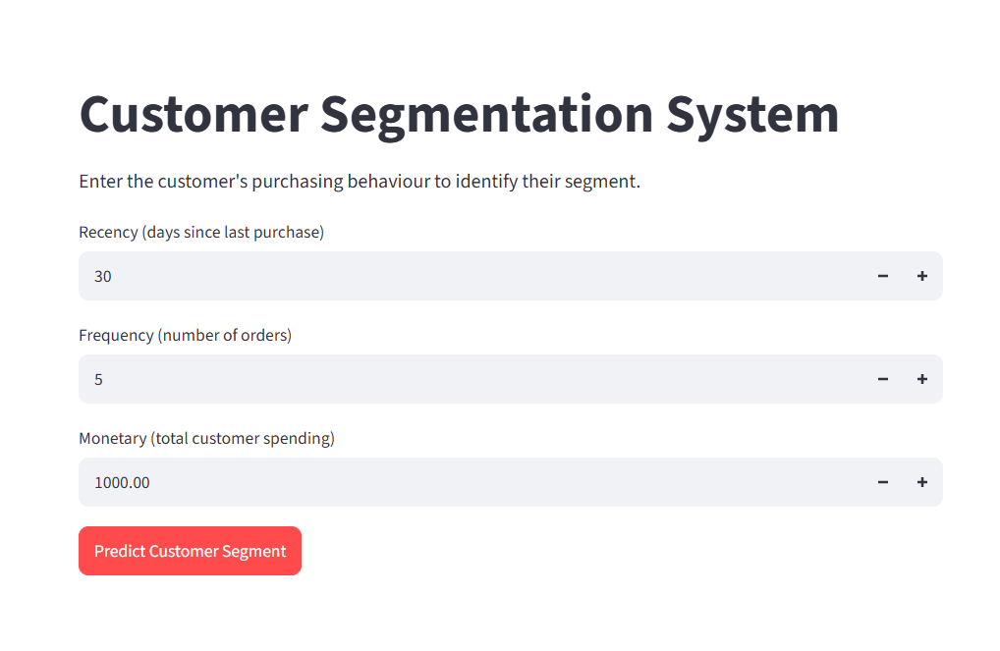
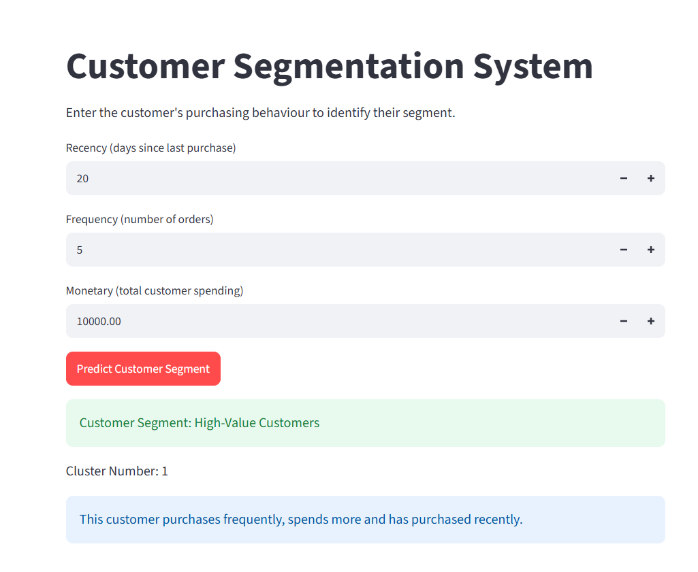

# Customer Segmentation System

A machine learning project that groups customers based on their purchasing behaviour using **RFM Analysis** and **K-Means Clustering**.

## Live Application

[Open Customer Segmentation App](https://ai-project-lab-8kp33hzgnjt9lichyottb5.streamlit.app/)

## Application Preview

### Customer Details Input



### Prediction Result



## Project Overview

The project analyses customers using the following RFM features:

- **Recency:** Number of days since the customer's last purchase
- **Frequency:** Total number of orders placed by the customer
- **Monetary:** Total amount spent by the customer

Based on these values, the model assigns each customer to a suitable segment.

## Customer Segments

- **High-Value Customers:** Recent, frequent, and high-spending customers
- **Regular Customers:** Customers with moderate purchasing activity
- **At-Risk Customers:** Customers who have not purchased recently and may require re-engagement

## Project Workflow

1. Loaded and explored the online retail dataset
2. Removed missing, duplicate, cancelled, and invalid transactions
3. Created Recency, Frequency, and Monetary features
4. Analysed feature distributions, skewness, and outliers
5. Applied `log1p` transformation to reduce skewness
6. Standardized features using `StandardScaler`
7. Compared different cluster values using the Elbow Method and Silhouette Score
8. Trained the final K-Means clustering model
9. Analysed the average RFM values of each cluster
10. Assigned meaningful customer segment names
11. Saved the trained model and preprocessing objects using Joblib
12. Built and deployed a Streamlit application

## Technologies Used

- Python
- Pandas
- NumPy
- Matplotlib
- Seaborn
- Scikit-learn
- Joblib
- Streamlit

## Project Structure

```text
customer-segmentation/
├── images/
│   ├── app-home.png
│   ├── prediction-result.png
│   └── cluster-visualization.png
├── app.py
├── customer_segmentation_model.pkl
├── customer_segmentation.ipynb
├── requirements.txt
└── README.md
```

## Model Details

The project uses **K-Means Clustering**, an unsupervised machine learning algorithm that groups customers with similar purchasing behaviour.

The number of clusters was selected using:

- **Elbow Method:** Compares inertia for different values of K
- **Silhouette Score:** Measures how well customers fit within their assigned clusters

A higher Silhouette Score represents better-separated clusters.

## Streamlit Application

The application accepts:

- Recency
- Frequency
- Monetary value

It then:

1. Applies the saved log transformation process
2. Scales the input using the trained scaler
3. Predicts the customer cluster
4. Displays the corresponding customer segment

## Run Locally

### 1. Clone the repository

```bash
git clone <your-repository-url>
cd ai-project-lab/customer-segmentation
```

### 2. Create a virtual environment

```bash
python -m venv venv
```

Activate it on Windows:

```bash
venv\Scripts\activate
```

Activate it on macOS or Linux:

```bash
source venv/bin/activate
```

### 3. Install dependencies

```bash
pip install -r requirements.txt
```

### 4. Run the application

```bash
streamlit run app.py
```

## Requirements

```text
streamlit
pandas
numpy
scikit-learn
joblib
```

## Important Note

Cluster numbers such as `0`, `1`, and `2` do not have fixed meanings. Customer segment names are assigned after examining the average Recency, Frequency, and Monetary values of each cluster.

## Author

**Bhargavi Goyal**
