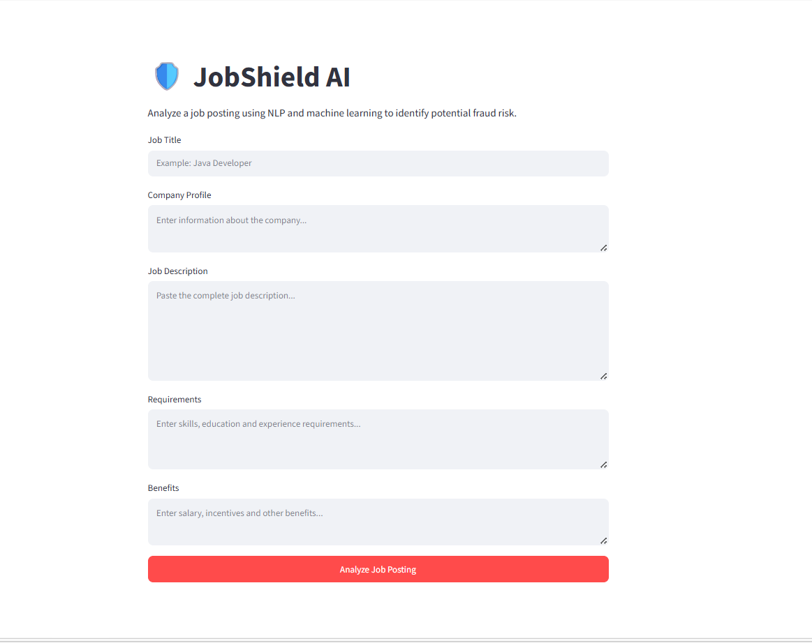
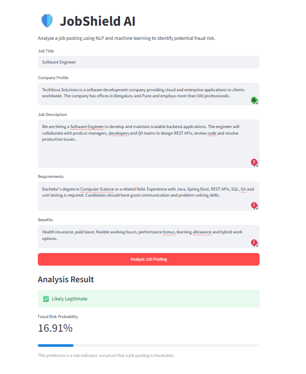
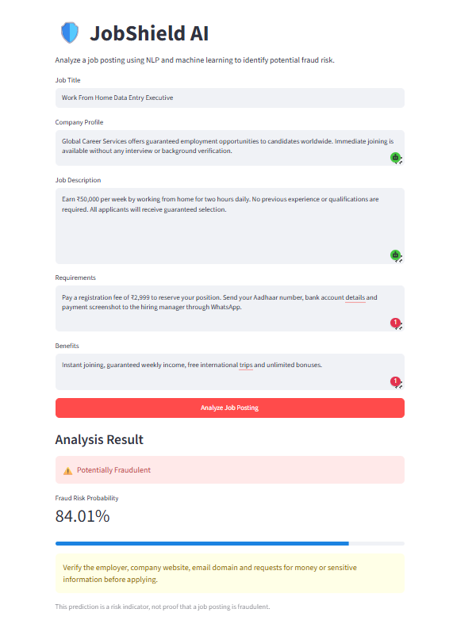

# JobShield AI 🛡️

JobShield AI is an NLP-based machine learning application that analyzes job postings and predicts whether they are likely to be legitimate or fraudulent.

## Live Application

Try the deployed application here:

### [Launch JobShield AI](https://ai-project-lab-vllqxux3auyi4ejavzornz.streamlit.app/)

## Application Preview



### Legitimate Job Prediction



### Fraudulent Job Prediction



## Problem Statement

Online job platforms may contain fraudulent postings designed to collect money or sensitive information from applicants.

JobShield AI provides an initial screening mechanism by analyzing the textual content of a job posting and estimating whether it appears legitimate or fraudulent.

## Input Fields

The application analyzes:

- Job title
- Company profile
- Job description
- Job requirements
- Employee benefits

These fields are combined into a single textual representation before being processed by the model.

## Features

- Interactive Streamlit interface
- Prediction for legitimate and fraudulent postings
- Fraud probability calculation
- Model confidence display
- Custom probability threshold
- Separate input fields representing a complete job posting
- Cached model loading for improved application performance

## Machine Learning Workflow

1. Load and inspect the fake job postings dataset
2. Handle missing textual values
3. Combine relevant job-posting fields
4. Convert text into numerical features using TF-IDF
5. Split the data into training and testing sets
6. Handle class imbalance using balanced class weights
7. Train a Logistic Regression classifier
8. Evaluate predictions using classification metrics
9. Save the trained model and vectorizer using Joblib
10. Integrate the saved files with a Streamlit application

## Model Architecture

```text
Job-posting fields
        ↓
Text combination
        ↓
TF-IDF vectorization
        ↓
Logistic Regression
        ↓
Fraud probability
        ↓
Legitimate/Fraudulent prediction
```

## Technologies Used

- Python
- Pandas
- NumPy
- Scikit-learn
- TF-IDF Vectorization
- Logistic Regression
- Joblib
- Streamlit

## Project Structure

```text
jobshield-ai/
├── assets/
│   ├── jobshield-home.png
│   ├── legitimate-result.png
│   └── fraudulent-result.png
├── app.py
├── fake_job_detector.pkl
├── tfidf_vectorizer.pkl
├── requirements.txt
└── README.md
```

## Run Locally

### 1. Clone the repository

```bash
git clone https://github.com/bhargavi8296/AI-Project-Lab.git
```

### 2. Open the project directory

```bash
cd AI-Project-Lab/jobshield-ai
```

### 3. Create a Python 3.12 virtual environment

```bash
py -3.12 -m venv venv
```

### 4. Activate the environment on Windows

```bash
venv\Scripts\activate
```

### 5. Install the dependencies

```bash
pip install -r requirements.txt
```

### 6. Run the Streamlit application

```bash
streamlit run app.py
```

## Model Evaluation

The dataset contains significantly fewer fraudulent job postings than legitimate postings. Therefore, accuracy alone is not sufficient for evaluating the model.

The following metrics are considered:

- **Precision:** Among jobs predicted as fraudulent, how many were actually fraudulent?
- **Recall:** Among all fraudulent jobs, how many did the model detect?
- **F1-score:** Balance between precision and recall
- **Confusion matrix:** Distribution of correct and incorrect predictions
- **Fraud probability:** Estimated probability of the positive fraud class

Recall is particularly important because a false negative represents a fraudulent posting incorrectly classified as legitimate.

## Example Fraud Indicators

The model may associate the following textual patterns with suspicious postings:

- Requests for registration or training fees
- Guaranteed selection without interviews
- Unrealistic salary promises
- Requests for banking or identity information
- Communication exclusively through WhatsApp or Telegram
- Vague company information
- Immediate joining without verification

A single indicator does not necessarily prove fraud. The prediction is based on the combined patterns learned from the training dataset.

## Limitations

- The model cannot verify whether a company legally exists.
- Predictions depend on patterns available in the training dataset.
- New or unusually written scams may not be detected.
- Very short and vague descriptions may produce unreliable results.
- Legitimate postings containing unusual language may be misclassified.
- The prediction should be treated as an initial warning, not definitive proof.

## Future Improvements

- Add explainable predictions showing influential words
- Introduce an uncertain category for low-confidence predictions
- Detect suspicious email addresses, phone numbers and payment requests
- Compare Logistic Regression with transformer-based models
- Add user feedback and model monitoring
- Build an API for integration with recruitment platforms

## Author

**Bhargavi Goyal**

- [GitHub](https://github.com/bhargavi8296)
- [AI Project Lab](https://github.com/bhargavi8296/AI-Project-Lab)
