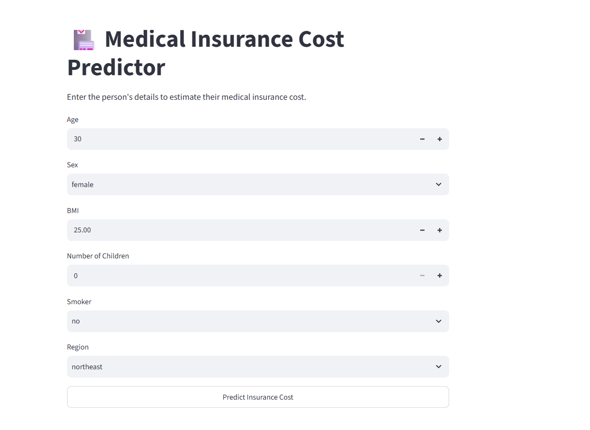
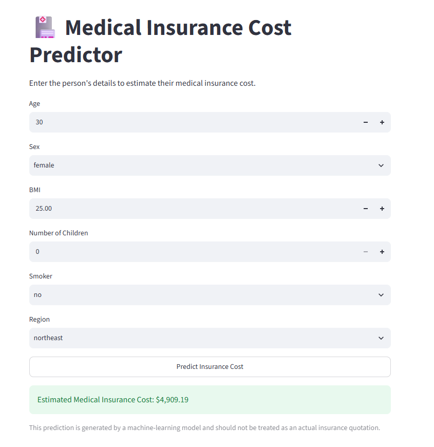

# MediCost AI

MediCost AI is a machine learning application that estimates medical insurance charges using details such as age, BMI, smoking status, number of children, gender, and region.

**Live App:** [Open MediCost AI](https://ai-project-lab-bbl8sdcbtttbsgkcmowjw3.streamlit.app/)

## Application





## Dataset

The project uses the [Medical Cost Personal Dataset](https://www.kaggle.com/datasets/mirichoi0218/insurance), containing the following columns:

- `age`
- `sex`
- `bmi`
- `children`
- `smoker`
- `region`
- `charges` — target variable

## Approach

1. Checked missing values and duplicate records
2. Performed exploratory data analysis
3. Encoded categorical columns using `OneHotEncoder`
4. Trained Linear Regression and Random Forest models
5. Tuned the Random Forest model to reduce overfitting
6. Saved the model and preprocessor using Joblib
7. Built and deployed the application using Streamlit

## Model Comparison


| Model | MAE | RMSE | R² Score |
|---|---:|---:|---:|
| Linear Regression | 4,177.05 | 5,956.34 | 0.8069 |
| Random Forest | 2,559.48 | 4,651.66 | 0.8822 |
| Tuned Random Forest | **2,438.68** | **4,382.73** | **0.8961** |

The tuned Random Forest was selected as the final model.

- Training R²: `0.9219`
- Testing R²: `0.8961`

## Technologies

- Python
- Pandas and NumPy
- Matplotlib and Seaborn
- Scikit-learn
- Joblib
- Streamlit

## Project Structure

```text
medical-insurance-predictor/
├── images/
├── app.py
├── insurance_model.pkl
├── preprocessor.pkl
├── requirements.txt
└── README.md
```

## Run Locally

Install the dependencies:

```bash
pip install -r requirements.txt
```

Start the application:

```bash
streamlit run app.py
```

## Disclaimer

This project is intended for learning purposes. The predicted value is not an actual insurance quotation.
