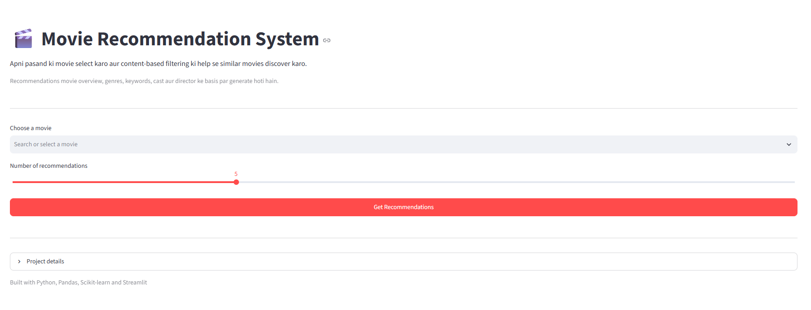
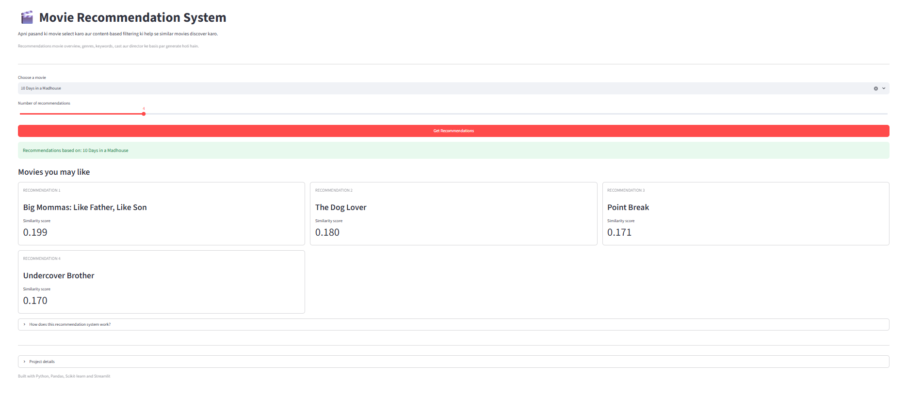

# Movie Recommendation System

A content-based movie recommendation system that recommends five movies similar to the movie selected by the user.

The system uses TF-IDF vectorization and cosine similarity to compare movie content. A Streamlit application provides the user interface.

## Live Application

[Open the Streamlit Application](https://ai-project-lab-zxnfdelgl4r72cc7zr2vwu.streamlit.app/)

## Application Preview

### Home Page



### Recommendations



## Project Overview

The user selects a movie from the available list. The system finds its TF-IDF vector, compares it with the vectors of other movies, and returns the five movies with the highest cosine similarity scores.

```text
Select a Movie
      ↓
Find its TF-IDF Vector
      ↓
Calculate Cosine Similarity
      ↓
Sort Movies by Similarity
      ↓
Display Top 5 Recommendations
```

## How It Works

### 1. Text Preparation

The textual information associated with each movie is cleaned and prepared for processing.

### 2. TF-IDF Vectorization

TF-IDF stands for **Term Frequency–Inverse Document Frequency**.

It converts movie text into numerical vectors:

- **Term Frequency:** Measures how frequently a word appears in a movie's text.
- **Inverse Document Frequency:** Gives less importance to common words and more importance to informative words.

After vectorization, every movie is represented by a TF-IDF vector.

### 3. Cosine Similarity

Cosine similarity measures the similarity between two TF-IDF vectors.

```text
Score close to 1 → Higher similarity
Score close to 0 → Lower similarity
```

The selected movie is compared with all other movies. The five movies with the highest similarity scores are returned.

The similarity score is not a movie rating or prediction probability. It only represents the similarity between two movie vectors.

## Example Output

```text
Recommendation 1
Movie: The Lucky One
Similarity Score: 0.228

Recommendation 2
Movie: Cavite
Similarity Score: 0.224

Recommendation 3
Movie: Three
Similarity Score: 0.212

Recommendation 4
Movie: The Good Guy
Similarity Score: 0.198

Recommendation 5
Movie: Adam Resurrected
Similarity Score: 0.185
```

The recommendations are displayed in descending order of their similarity scores.

## Features

- Movie selection from the available dataset
- Five content-based movie recommendations
- Similarity score for each recommendation
- Precomputed TF-IDF vectors for faster results
- Streamlit-based user interface
- Deployed web application

## Technology Stack

- Python
- Pandas
- Scikit-learn
- TF-IDF Vectorizer
- Cosine Similarity
- Joblib/Pickle
- Streamlit

## Project Structure

```text
movie-recommendation-system/
├── app.py
├── movies.pkl
├── tfidf_vectors.pkl
├── requirements.txt
├── README.md
└── images/
    ├── home-page.png
    └── recommendations.png
```

| File | Description |
|---|---|
| `app.py` | Streamlit application |
| `movies.pkl` | Processed movie information |
| `tfidf_vectors.pkl` | Precomputed TF-IDF vectors |
| `requirements.txt` | Required Python packages |
| `images/` | Application screenshots |

The artifact names may differ depending on how the processed data was saved.

## Run Locally

### 1. Clone the repository

```bash
git clone <your-repository-url>
cd AI-Engineering-Lab/movie-recommendation-system
```

### 2. Create a virtual environment

```bash
python -m venv venv
```

Activate it on Windows:

```bash
venv\Scripts\activate
```

Activate it on macOS or Linux:

```bash
source venv/bin/activate
```

### 3. Install dependencies

```bash
pip install -r requirements.txt
```

### 4. Run the application

```bash
streamlit run app.py
```

The application will usually be available at:

```text
http://localhost:8501
```

## Requirements

A typical `requirements.txt` contains:

```text
streamlit
pandas
scikit-learn
joblib
```

The package versions should be compatible with the versions used to create the saved artifacts.

## Saved Artifacts

The application loads previously processed movie data and TF-IDF vectors instead of calculating them every time it starts.

```text
Process Movie Data
      ↓
Generate TF-IDF Vectors
      ↓
Save Artifacts
      ↓
Load Artifacts in Streamlit
      ↓
Generate Recommendations
```

This reduces application startup and recommendation time.

## Git LFS

The `tfidf_vectors.pkl` file may exceed GitHub's normal file-size limit. It can be tracked using Git LFS.

```bash
git lfs install
git lfs track "movie-recommendation-system/tfidf_vectors.pkl"
git add .gitattributes
git add movie-recommendation-system/tfidf_vectors.pkl
git commit -m "Add movie recommendation system artifacts"
git push origin master
```

## Adding Screenshots

Create an `images` directory inside the project:

```text
movie-recommendation-system/
└── images/
    ├── home-page.png
    └── recommendations.png
```

Save:

- The main application screenshot as `home-page.png`
- The recommendation result screenshot as `recommendations.png`

Then add and push them:

```bash
git add movie-recommendation-system/images
git commit -m "Add application screenshots"
git push origin master
```

## Limitations

- Recommendations depend on the available movie metadata.
- User ratings and viewing history are not considered.
- New movies must be added to the dataset before they can be recommended.
- Similarity scores may be low when the dataset has no strongly related movie.

## Possible Improvements

- Display movie posters and descriptions
- Add genre and release-year filters
- Include user ratings and viewing history
- Combine content-based and collaborative filtering
- Explain which features caused a recommendation

## Learning Outcomes

This project covers:

- Text preprocessing
- TF-IDF feature extraction
- Cosine similarity
- Content-based recommendation systems
- Saving and loading processed artifacts
- Building and deploying a Streamlit application
