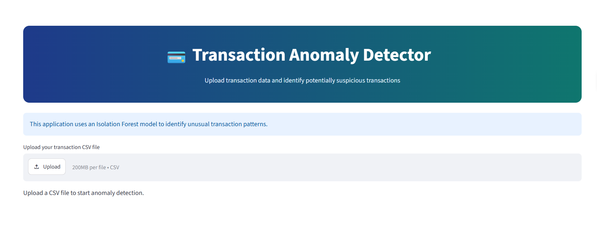
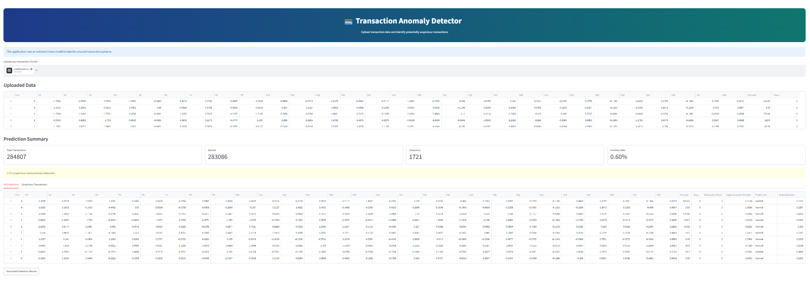

# Transaction Anomaly Detector

An unsupervised machine-learning project that identifies unusual credit-card transactions using the Isolation Forest algorithm.

The model learns patterns from normal transactions and marks transactions that differ significantly from those patterns as anomalies.

## Live Application

[Open the Streamlit Application](https://ai-project-lab-mlw5mu3ruuudfxe9ymfxmz.streamlit.app/)

## Application Preview

### Transaction Input



### Prediction Result



## Project Overview

Credit-card transaction datasets are highly imbalanced because fraudulent transactions are much less common than normal transactions.

The dataset used in this project contains:

```text
Normal transactions: 99.827%
Fraudulent transactions: 0.173%
```

Isolation Forest is used to detect transactions that do not follow the patterns learned from normal transactions.

```text
Transaction Data
       ↓
Data Preparation
       ↓
Train on Normal Transactions
       ↓
Calculate Anomaly Score
       ↓
Normal or Anomalous
```

## Dataset

The dataset contains the following columns:

- `Time`
- `V1` to `V28`
- `Amount`
- `Class`

The `Class` column contains the actual transaction label:

| Class | Meaning |
|---|---|
| `0` | Normal transaction |
| `1` | Fraudulent transaction |

The `V1` to `V28` columns are numerical features created using PCA. Their original meanings are hidden to protect confidential transaction information.

## Data Preparation

The following steps were performed:

1. Loaded and inspected the dataset.
2. Checked missing values and duplicate rows.
3. Examined the class distribution.
4. Converted transaction time into `TransactionHour`.
5. Selected the required features.
6. Split the data into training and testing sets.
7. Trained the model using only normal training transactions.

## Features Used

The final model uses:

```text
V1, V2, V3, ..., V28, TransactionHour
```

A total of 29 features are used.

The original `Time` value is converted into an hour:

```python
TransactionHour = (Time / 3600) % 24
```

Although the original meanings of `V1` to `V28` are hidden, these columns contain the main transaction patterns required by the model.

## Isolation Forest

Isolation Forest is an unsupervised anomaly-detection algorithm.

Its basic idea is that unusual transactions are generally easier to separate from the dataset than normal transactions.

The algorithm creates several random isolation trees. In every tree:

1. A feature is selected randomly.
2. A random split value is selected.
3. Transactions are divided into smaller groups.
4. Splitting continues until observations are isolated.

An unusual transaction generally requires fewer splits to be isolated.

```text
Fewer splits
     ↓
More likely to be an anomaly
```

## Model Training

The model was trained only on normal transactions:

```python
X_train_normal = X_train[y_train == 0]

model.fit(X_train_normal)
```

This allows the model to learn normal transaction behaviour.

The fraud labels were not used during training. They were used later to evaluate the predictions.

## Prediction Output

Isolation Forest returns:

| Model Output | Meaning |
|---|---|
| `1` | Normal transaction |
| `-1` | Anomalous transaction |

The output can be converted into normal binary labels:

```python
predictions = model.predict(X_test)
predictions = np.where(predictions == -1, 1, 0)
```

After conversion:

| Label | Meaning |
|---|---|
| `0` | Normal transaction |
| `1` | Anomalous transaction |

An anomaly prediction does not confirm that a transaction is fraudulent. It only means that the transaction is unusual according to the model.

## Anomaly Score

The model calculates an anomaly score for every transaction.

The score can be used to:

- Compare transaction behaviour
- Rank unusual transactions
- Prioritize transactions for further investigation

A transaction with a stronger abnormal pattern will receive a different score from transactions that closely match the normal data.

## Model Evaluation

One experiment produced the following confusion matrix:

```text
[[56339   312]
 [   58    37]]
```

| Result | Count |
|---|---:|
| Normal transactions correctly predicted | 56,339 |
| Normal transactions marked as anomalies | 312 |
| Fraudulent transactions missed | 58 |
| Fraudulent transactions detected | 37 |

Fraud-class results:

```text
Precision: 0.1060
Recall:    0.3895
F1-score:  0.1667
```

The model detected 37 out of 95 fraudulent transactions in this experiment.

Overall accuracy is not the most useful metric because most transactions are normal. Precision, recall, F1-score and the confusion matrix provide a better understanding of fraud-detection performance.

## Contamination Experiments

The contamination parameter controls the expected proportion of anomalies.

| Contamination | Precision | Recall | F1-score |
|---:|---:|---:|---:|
| 0.001 | 0.2857 | 0.2105 | 0.2424 |
| 0.002 | 0.1818 | 0.2632 | 0.2151 |
| 0.003 | 0.1772 | 0.3684 | 0.2393 |
| 0.005 | 0.1487 | 0.5263 | 0.2319 |
| 0.010 | 0.1041 | 0.6974 | 0.1812 |

Increasing contamination caused the model to identify more fraud cases, but it also increased the number of normal transactions marked as anomalies.

The suitable value depends on whether detecting more fraud or reducing false alarms is more important.

## Streamlit Application

The Streamlit application:

1. Loads the saved model.
2. Accepts transaction feature values.
3. Arranges the values in the same order used during training.
4. generates a prediction and anomaly score.
5. Displays whether the transaction is normal or anomalous.

Live application:

[Transaction Anomaly Detector](https://ai-project-lab-mlw5mu3ruuudfxe9ymfxmz.streamlit.app/)

## Model Artifact

The model and feature names are stored together:

```python
model_artifact = {
    "model": final_model,
    "features": feature_columns
}
```

The artifact is saved using Joblib:

```python
joblib.dump(
    model_artifact,
    "transaction_anomaly_detector.pkl"
)
```

It is loaded in the Streamlit application using:

```python
artifact = joblib.load("transaction_anomaly_detector.pkl")

model = artifact["model"]
features = artifact["features"]
```

Saving the feature names ensures that input values are passed to the model in the correct order.

## Features

- Isolation Forest-based anomaly detection
- Model trained on normal transactions
- Anomaly prediction and anomaly score
- Streamlit user interface
- Saved model and feature information
- Deployed web application

## Technology Stack

- Python
- Pandas
- NumPy
- Scikit-learn
- Isolation Forest
- Joblib
- Streamlit

## Project Structure

```text
transaction-anomaly-detector/
├── app.py
├── transaction_anomaly_detector.pkl
├── requirements.txt
├── README.md
└── images/
    ├── home-page.png
    └── prediction-result.png
```

| File | Description |
|---|---|
| `app.py` | Streamlit application |
| `transaction_anomaly_detector.pkl` | Saved model and feature names |
| `requirements.txt` | Required Python packages |
| `README.md` | Project documentation |
| `images/` | Application screenshots |

## Run Locally

### 1. Clone the repository

```bash
git clone <your-repository-url>
cd AI-Engineering-Lab/transaction-anomaly-detector
```

### 2. Create a virtual environment

```bash
python -m venv venv
```

Activate it on Windows:

```bash
venv\Scripts\activate
```

Activate it on macOS or Linux:

```bash
source venv/bin/activate
```

### 3. Install dependencies

```bash
pip install -r requirements.txt
```

### 4. Run the application

```bash
streamlit run app.py
```

The application will usually be available at:

```text
http://localhost:8501
```

## Requirements

A typical `requirements.txt` contains:

```text
streamlit
pandas
numpy
scikit-learn
joblib
```

Use package versions compatible with those used to create the saved model.

## Adding Screenshots

Create an `images` folder inside the project:

```text
transaction-anomaly-detector/
└── images/
    ├── home-page.png
    └── prediction-result.png
```

Save:

- The main application screenshot as `home-page.png`
- The prediction screenshot as `prediction-result.png`

Add the screenshots to Git:

```bash
git add transaction-anomaly-detector/images
git commit -m "Add application screenshots"
git push origin master
```

## Dataset and Git LFS

The original `creditcard.csv` file is larger than GitHub's normal 100 MB file-size limit.

If the dataset needs to be stored in the repository, use Git LFS:

```bash
git lfs install
git lfs track "transaction-anomaly-detector/creditcard.csv"
git add .gitattributes
git add transaction-anomaly-detector/creditcard.csv
git commit -m "Add credit card dataset using Git LFS"
git push origin master
```

The trained model file can also be tracked with Git LFS if it exceeds GitHub's normal file-size limit.

## Limitations

- An anomalous transaction is not always fraudulent.
- Some normal transactions may be marked as anomalies.
- Some fraudulent transactions may remain undetected.
- The meanings of `V1` to `V28` are not available.
- Customer and merchant histories are not included.
- Predictions depend on the selected contamination value.
- The model should support investigation rather than act as the only basis for a financial decision.

## Possible Improvements

- Tune the decision threshold using validation data
- Compare Isolation Forest with other anomaly-detection algorithms
- Add a supervised fraud-classification model for comparison
- Combine model predictions with transaction rules
- Use customer and merchant history when available
- Add an investigation dashboard for flagged transactions

## Learning Outcomes

This project covers:

- Imbalanced transaction data
- Unsupervised anomaly detection
- Isolation Forest
- Feature preparation
- Contamination tuning
- Precision, recall and F1-score
- Confusion-matrix interpretation
- Saving and loading model artifacts
- Building and deploying a Streamlit application
